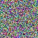
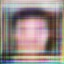
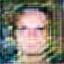

# Image Dataset Generation
Generate images via a Generative Adversarial Network (GAN)

# What is GAN?
A GAN is a method for discovering and subsequently artificially generating the underlying distribution of a dataset;
a method in the area of unsupervised representation learning. Most commonly it is applied to image generation tasks.

A GAN combines two neural networks, called a Discriminator (D) and a Generator (G). Given a dataset, G takes as input 
random noise, and tries to produce something that resembles an item within the dataset. D takes as input both items 
within the real dataset and the artifical data produced by G, and tries to distinuish between the two. G and D are trained jointly. 
The important point is that G and D need to balance one another, neither can become too strong at their task with respect to the other. 
If G becomes very good at fooling D, this is usually because G has found a weakness in D's classification process which is not
aligned with important features within the distribution. If D can easily tell artificial images from real ones, updating
G's weights towards the right direction is a very very slow process, essentially G will not be able to learn from this process.

# How does this GAN work?
I heavily borrowed from a number of other implementations [[1]](https://github.com/aleju/cat-generator)However, 
with the other implementations I could not produce (decent) images on a single CPU in a short time frame, so I took
a new approach to jointly train G and D, guaranteeing neither becomes too strong with respect to the other. Both G and D 
are DCNNs (deep convolutional neural networks), Batch Normalization is used for G but not for D, as in previous 
experiments [[2]](http://torch.ch/blog/2015/11/13/gan.html) I found Batch Normalization in D made D far too good at 
distinguishing artifical images from real images.

To ensure that neither G nor D become to good at their respective tasks, I first defined a margin of error, e, such that:

|(training loss of G) - (training loss of D)| < e , for each training batch.

This results in the lesser of the training of loss of G and D swapping at each successive training batch,
resulting in neither becoming too powerful. In other words,

if (training loss of G)<(training loss of D),

then at the next batch,

(training loss of D)<(training loss of G).

### Training a GAN is extremely tough, a lot of care has to be paid to tuning the learning rate parameter (as well as other parameters), and takes a long time to get right.

# Result

Here are some quick and dirty results after training on ~400 images of faces. Experiments were performed on a HP Pavilion  AMD Ryzen 5

Initial noise produce by an untrained Generator.

After training for 5-10 minutes.

After training for 20-25 minutes.

# Experience
Overall this was a fun side-project. I used a very small training set of about 400 images and  with a single CPU machine was able to generate face like shapes within a few minutes, and more detailed faces withing a few hours. 
I imagine there are many ways to improve the training process to improve results. The limitation of 64x64 images means even after a long time images still look fairly distorted. 
I have now begun training on a dataset consisting of thousands of images, which will take substantially longer to train but will hopefully produce better results.

### Below is a 1.33 min of video Neural Network learning to generate cat images (model G32up-c) by Alexander Jung [[youtube video]](https://www.youtube.com/watch?v=JRBscukr7ew) for refrence.
